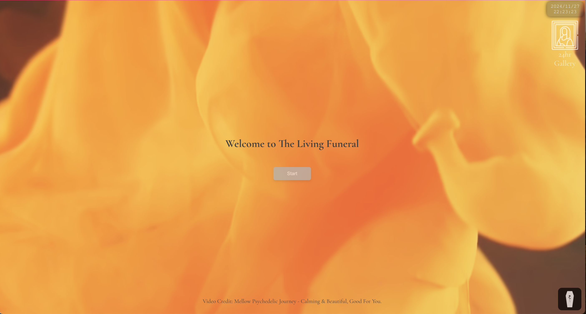

# The Living Funeral 🖤

**The Living Funeral** is an interactive web-based extension of a physical art installation, designed to provoke deep reflection through AI-driven experiences. The project explores the profound themes of life, death, and self-reflection, immersing users in a unique and thought-provoking journey.

🌐 **Explore it here:** [The Living Funeral](https://www.thelivingfuneral.art)

---

## ✨ Experience

The journey begins with a series of reflective questions, such as:

- *"What are the three most important things in your life?"*
  
Based on the user's responses, the interactions adapt dynamically, creating a highly personalized experience. The user progresses through **three stages of death**, each offering an opportunity to reflect on their life path and mortality.

In the final stage, the experience culminates in a **customized eulogy**, generated using AI and based on the user's earlier answers. 

---

## 🛠️ Technology Stack

- **ChatGPT (GPT-4 Vision/Completion Model):** Drives adaptive, conversational interactions.
- **ElevenLabs Text-to-Speech API:** Adds an authentic, immersive narration experience.
- **React:** Powers the modern, dynamic frontend.
- **Next.js:** Handles the scalable backend.
- **Vercel:** For seamless deployment.
- **Backblaze B2:** For efficient cloud storage.

---

## 🎭 About the Project

This project aims to blend art and technology, offering participants a deeply personal and introspective experience. By simulating the end of life, it provides a unique space to consider one's values, choices, and legacy.

---

## 🚀 Deployment

The Living Funeral is deployed on **Vercel**, with **Backblaze B2** utilized for storage. The seamless integration of cutting-edge AI tools ensures a smooth and engaging user experience.

---

Step into this one-of-a-kind journey and reflect on the path of life and its inevitable conclusion.
